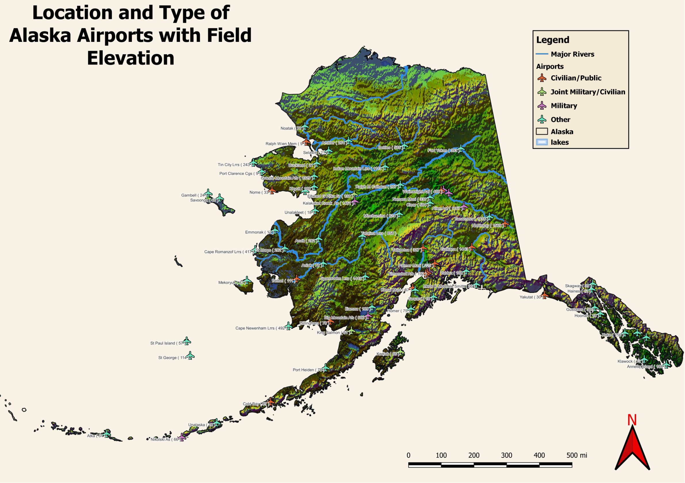
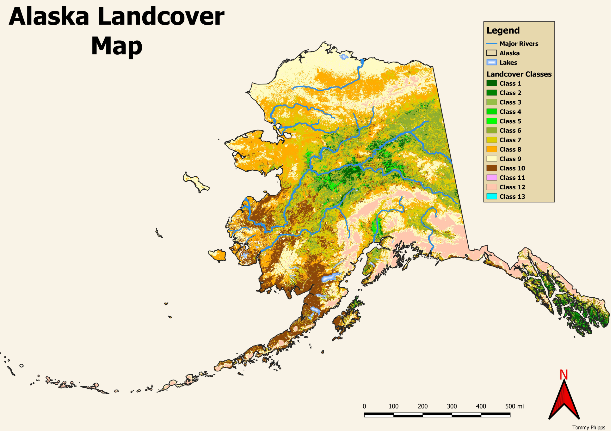

## Portfolio

---

### School Mapping Projects 

#### GES 486

 This is an example map created in QGIS showing airport location, type, and elevation in meters. 

---

#### GES 486

 Example landcover map for Alaska made in QGIS

---

#### GES 383 

I produced this map using spring turkey harvest data by Maryland counties for 2021. The data was obtained from the Maryland DNR website and then inputed into excel then exported as a .csv, I then merged the .csv with a shapefile of Maryland counties, and then set the symbology to total turkey harvest by county.

---

### GES 486 Final Project

For my final project showing off what R programming skills I learned this semster, I chose to examine opioid overdoses in Baltimore City for the year 2020. More specifically, I wanted to examine the relationship between the location of Naloxone (Narcan) providers to areas in the city where there is a higher concentration of overdoses. Additionally I examined the location of the Naloxone providers in relation to median household income by census tract as well as racial demographics by census tract, in order to see if there were any disparities in the location of the providers. Lastly I created a map showing minimum distance to Naloxone providers from the centroids of CSA's. All of the following maps were created by me in Rstudio. A PDF of the RMD for this final project is linked under the "Programming Portfolio" section of this page. 

#### Map of Naloxone Provider Locations Compared to Overdose Calls for Service per 2,000 Residents (2020)
 

This map shows Naloxone provider locations (red dots) overlaid on a map of overdose calls for service per 2,000 residents by CSA for the Year 2020

#### Map of Naloxone Provider Locations Compared to Median Household Income by Census Tract
 

This map shows Naloxone provider locations in relation to median household income by census tract

#### Faceted Map of Racial Demographics by Census Tract
 
 
 These maps were created with the tmap package in Rstudio and shows racial demographics by census tract

#### Map of Naloxone Provider Locations Compared to Percent Black by Census Tract
 

Census data retrieved using the tidycensus package for Rstudio

#### Map of Naloxone Provider Locations Compared to Percent White by Census Tract

Census data retrieved using the tidycensus package for Rstudio

![Minimum Distance to Naloxone Provider](/images/

---

### Programming Portfolio 

- [Projecet 2 Title]
- [Project 3 Title]
- [Project 4 Title]
- [Project 5 Title]

---

Page template forked from <a href="https://github.com/evanca/quick-portfolio">evanca</a>

<!-- Remove above link if you don't want to attibute -->
