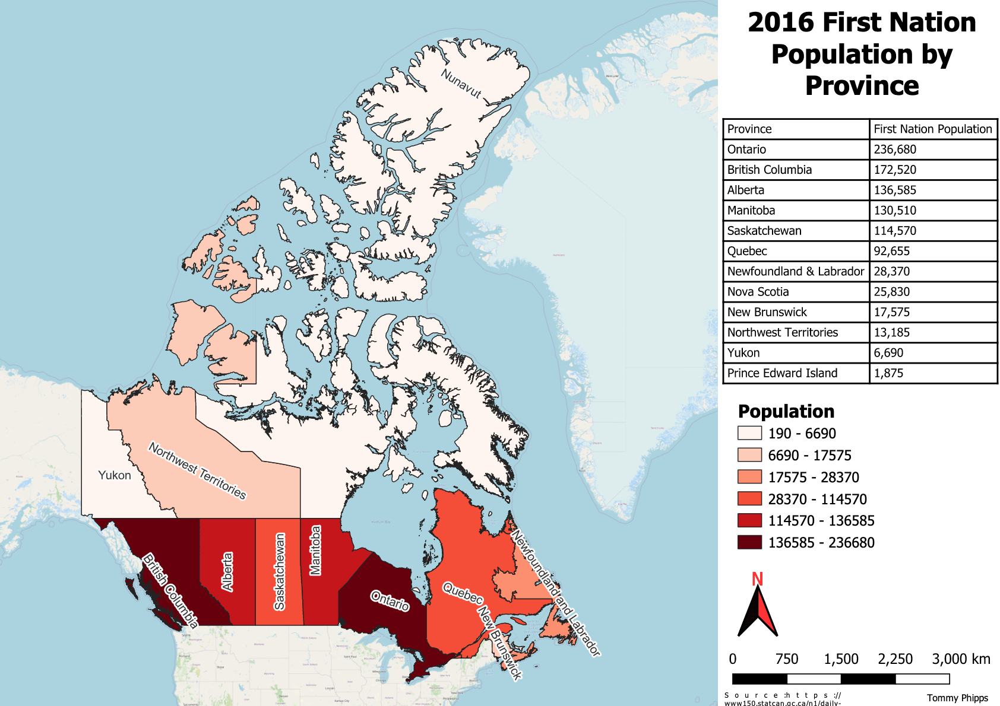

## Portfolio (&#128679; Under Construction &#128679;)

---

### School Mapping Projects 

#### GES 486

 This is an example map created in QGIS showing airport location, type, and elevation in meters. 

---

#### GES 486

 Example landcover map for Alaska made in QGIS

---

#### GES 486

 
 This map was made in QGIS and shows First Nation population by Canadian Province 

---

#### GES 383 

<a href="tphipps05.github.io/pdfs/Lab2_inkscape_final_PDF.pdf" target="_blank">PDF.</a>
I produced this map using spring turkey harvest data by Maryland counties for 2021

---

### Personal Mapping Projects

- [Project 1 Title](http://example.com/)
- [Project 2 Title](http://example.com/)
- [Project 3 Title](http://example.com/)
- [Project 4 Title](http://example.com/)
- [Project 5 Title](http://example.com/)

---

### Programming Portfolio 

- Working with Census Data in R, Chapters 5-1 of Walker
<a href="tphipps05.github.io/pdfs/PHIPPS_lab_3_merge.pdf" target="_blank">PDF.</a>

Tutorial and basic exercises on manipulating and displaying census data in Rstudio.
- [Projecet 2 Title]
- [Project 3 Title]
- [Project 4 Title]
- [Project 5 Title]

---

Page template forked from <a href="https://github.com/evanca/quick-portfolio">evanca</a>

<!-- Remove above link if you don't want to attibute -->
